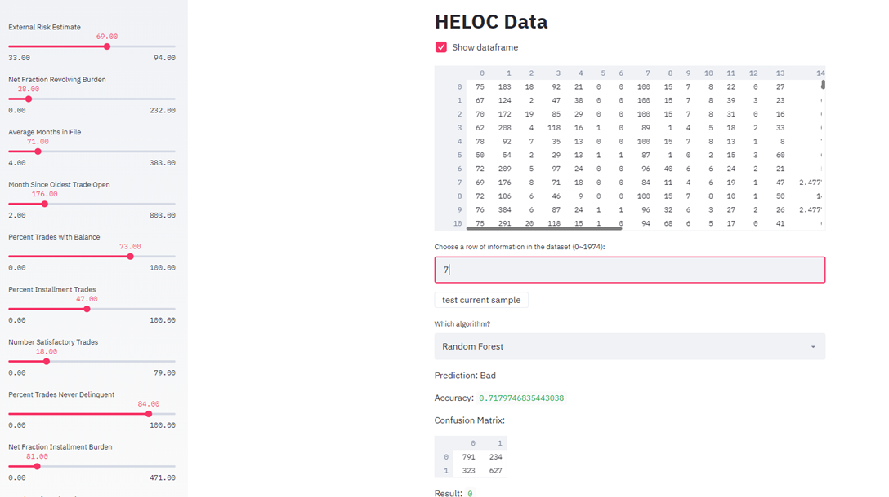

## Portfolio

---

### Group Case

---

### Greek Yogurt Flavor Recommendation - using SQL, Tableau & R

[Slides](pdf/Greek Yogurt Flavor Recommendation Case.pdf)

[R Code](pdf/Greek-Yogurt-Case-Code.html)

 

---

### Toy Horse Conjoint Analysis - using R & Excel

[Slides](pdf/Toy Horse Recommendation Case.pdf)

[R Code First Half](pdf/Toy-Horse-Case-Code1.html)

[R Code Second Half](pdf/Toy-Horse-Case-Code2.html)

---

### Wine Retailer Email to Target Customers - using R 

[Slides](pdf/Wine Retailer Case.pdf)

[R Code](pdf/Email to Wine Purchasers.html)

---

### Assessment of the credit risk of Home Equity Line of Credit(HELOC) Dataset - using Python & Streamlit

[Slides](pdf/Python Project 2.pdf)

[Report](pdf/Python Project 2 Report.pdf)

[Python Data Cleaning Code](pdf/Presentation II Data Cleaning - Team 26.html)

[Python Model Code](pdf/Presentation II Model - Team 26.html)

---

### Competition

---

### Pricing Competition - using R & Tableau

---

### Category Name 2

- [Project 1 Title](http://example.com/)
- [Project 2 Title](http://example.com/)
- [Project 3 Title](http://example.com/)
- [Project 4 Title](http://example.com/)
- [Project 5 Title](http://example.com/)

---

Page template forked from <a href="https://github.com/evanca/quick-portfolio">evanca</a>

<!-- Remove above link if you don't want to attibute -->
